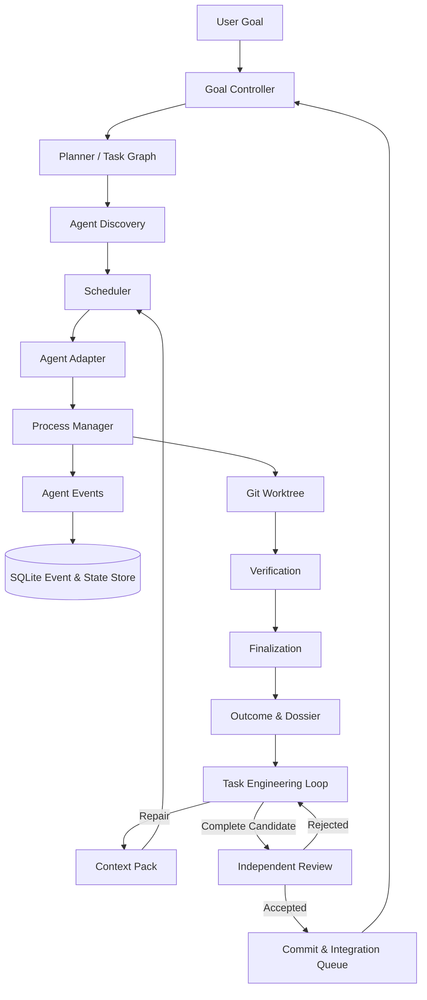
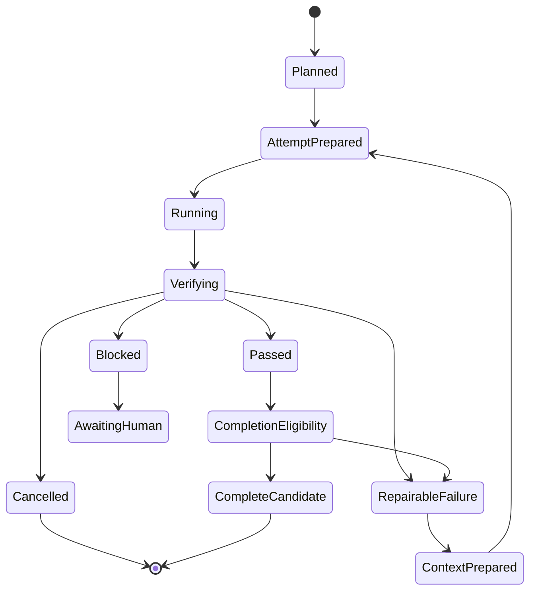

# Agent Harness

> 面向长周期软件工程任务的本地优先、多 Agent、可恢复、可验证执行系统。

Agent Harness 不是一个“把多个模型接在一起聊天”的简单编排器。它的目标是把 Claude Code、Codex CLI、Gemini、DeepSeek、GLM 等本地可调用 Agent，组织成一个能够长期运行、持续修复、可靠恢复、严格验证并最终交付工程结果的执行系统。

系统强调：

- 一个用户目标，而不是多轮重复描述
- 自动发现本机可用 Agent 与模型配置
- 自动拆解、分配、执行、验证与恢复
- 所有关键状态持久化
- 所有完成声明必须有可验证证据
- 崩溃、超时、重复调用和多进程竞争不会破坏任务一致性
- Agent 生成结果不等于任务完成
- Harness 自身也可以成为长期自我改进的研究对象

---

## 1. 项目愿景

传统 Coding Agent 往往擅长完成一次短任务，却容易在长周期工程中出现：

- 上下文丢失和目标漂移
- 任务拆解不稳定
- 多 Agent 重复修改同一文件
- 重试导致重复副作用
- 进程崩溃后无法安全恢复
- Agent 声称成功，但测试或交付仍然失败
- 多个执行器竞争同一任务
- 工作区、数据库和 Git 状态不一致
- 用户需要反复告诉不同 Agent 相同背景

Agent Harness 希望提供一个稳定的执行底座：

```text
User Goal
→ Goal Clarification
→ Task Planning
→ Agent Discovery
→ Capability-Aware Scheduling
→ Isolated Execution
→ Deterministic Verification
→ Evidence-Gated Repair
→ Candidate Review
→ Commit and Integration
→ Goal-Level Replanning
→ Deliverable
```

最终理想体验是：

```text
用户只描述一次目标
→ Harness 理解并确认目标
→ 自动发现本机 Agent
→ 自动拆解和分配任务
→ 自动执行、测试、修复和恢复
→ 只在真正需要时请求人工决策
→ 返回经过验证的工程交付物
```

---

## 2. 核心设计原则

### 2.1 Local-First

Harness 优先使用用户本机已经安装、已经登录或已经配置的 Agent CLI。

它不应：

- 强制用户迁移到单一模型供应商
- 自动升级 Agent
- 修改全局认证配置
- 覆盖用户已有环境变量
- 静默切换 Provider
- 将代码和密钥上传到未知服务

### 2.2 Durable by Default

关键事实不能只存在于内存中。

Harness 使用 SQLite 和追加式事件记录保存：

- Task
- Attempt
- Execution
- Operation
- Agent Event
- Resource Claim
- Workspace
- Verification Run
- Evidence
- Outcome
- Dossier
- Decision
- Context Pack
- Budget Usage
- Ownership / Lease / Fencing

进程退出后，新的 Runtime 实例应能够只依靠持久化事实恢复执行。

### 2.3 Evidence Before Completion

Agent 的自然语言声明不是完成证据。

```text
Agent says "done"
≠
Task is complete
```

只有当以下事实全部满足时，任务才可以进入完成候选状态：

- Execution 已进入合法终态
- Required Verification Steps 已执行
- 所有必要证据存在
- Outcome 为 Passed
- Dossier 存在且指纹一致
- 进程已经结束
- Reconciliation 已完成
- Workspace 与 Ownership 有效
- Observation 未过期
- Completion Gate 通过

### 2.4 Exactly-Once Effects over At-Least-Once Execution

分布式或本地多进程环境中，调用可能重复，响应可能丢失。

Harness 不假设函数只会被调用一次，而是通过：

- Idempotency Key
- Operation Log
- CAS
- Lease
- Fencing Token
- Unique Constraint
- Recovery Reconciliation

保证关键副作用最多发生一次。

### 2.5 Immutable History

已经完成的 Attempt、Execution、Outcome 和 Dossier 不应被重新解释或覆盖。

新的修复应创建：

```text
New Attempt
→ New Execution
→ New Evidence
→ New Outcome
```

而不是修改历史事实。

### 2.6 Separation of Generation and Judgment

生成代码的 Agent 不应成为唯一的验收者。

Harness 将以下职责分开：

- Generation
- Execution
- Verification
- Finalization
- Review
- Integration

确定性验证优先于 LLM Judge。

---

## 3. 系统架构



系统分为四个平面：

### Execution Plane

```text
Task → Attempt → Execution → Agent → Tool / Process → Verification → Outcome
```

### Control Plane

```text
Goal Controller
Task Planner
Scheduler
Ownership
Resource Claims
Budget Policy
Recovery
Reconciliation
```

### Evidence Plane

```text
Events
Verification Runs
Step Results
Evidence
Outcome
Dossier
Fingerprints
Audit Reports
```

### Improvement Plane

```text
Trace Mining
→ Failure Attribution
→ Harness Patch Proposal
→ Isolated Evaluation
→ Held-Out Regression
→ Promotion / Rollback
```

---

## 4. 核心实体

### Task

用户目标拆解后的工程任务。Task 描述“要实现什么”，而不是“某一次 Agent 调用”。

### Attempt

对同一 Task 的一次完整解决尝试。失败后不会修改原 Attempt，而是创建新的 Attempt。

### Execution

Attempt 中一次具体的 Agent 执行实例。

### Operation

跨 SQLite、Git、文件系统和进程的持久化 Saga。Operation 用于记录多步骤动作进展，使系统可以在中途崩溃后继续或补偿。

### Outcome

Verification 与 Finalization 产生的不可变结果：

- Passed
- RepairableFailure
- InfrastructureBlocked
- AwaitingHuman
- Cancelled
- ReconciliationRequired

### Dossier

与 Outcome 绑定的结构化证据包，包括：

- 执行摘要
- Required Steps
- 测试结果
- 证据引用
- Workspace 指纹
- 失败分类
- 资源使用
- 安全检查

### Context Pack

传递给下一 Attempt 的受控上下文，不等同于完整聊天记录。

它应包含：

- 当前目标
- 不变量
- 已完成工作
- 未解决问题
- 上次失败原因
- Verification 证据
- Workspace 状态
- 下一步修复建议

### Resource Claim

用于防止多个 Agent 同时修改冲突资源。

支持：

- `ExactFile`
- `DirectoryPrefix`
- `RepositoryWide`
- `Logical`

读取之间可以兼容，写入冲突必须被阻止或序列化。

---

## 5. Task Engineering Loop

I4.5 的核心是 Evidence-Gated Task Engineering Loop。



一次完整修复循环应满足：

```text
Attempt 1
→ Agent 修改 Worktree
→ Verification 失败
→ Finalized Repairable Outcome
→ ContinueRepair Decision
→ Context Pack
→ Attempt 2
→ 继承 Attempt 1 未提交修改
→ Agent 继续修复
→ Verification 通过
→ CompleteCandidate
```

---

## 6. Workspace 与 Git 模型

每个 Task 使用隔离的 Git Worktree，避免不同任务直接争用主工作区。

Harness 负责：

- 创建和登记 Worktree
- 保存 baseline commit
- 校验 HEAD
- 计算 diff fingerprint
- 记录 Workspace ownership
- 跨 Attempt 延续未提交修改
- 防止旧 owner 继续写入
- 在 I5 之前不自动 commit、merge 或 rebase

跨 Attempt continuation 不是复制文件，而是：

```text
Attempt 2
→ ContinueFromAttempt
→ 验证 source_attempt_id
→ 验证 source_execution_id
→ 验证 Worktree
→ 验证 baseline / HEAD / diff fingerprint
→ 获取新 fencing token
→ 拒绝旧 owner
→ 继续使用原有未提交修改
```

---

## 7. 多 Agent 发现与适配

Harness 不写死 Agent 列表，而是扫描本机可用能力。

可能发现：

- Claude Code
- Codex CLI
- Gemini CLI
- Anthropic-Compatible CLI
- OpenAI-Compatible CLI
- 本地模型包装器
- 用户自定义 Agent

Discovery 应记录：

```text
Executable
Version
Invocation Mode
Provider
Authentication Source
Supported Models
Working Directory Support
Streaming Support
Cancellation Support
Timeout Support
Structured Output Support
Wrapper Relationship
```

Harness 不应私自升级 Agent，也不应假设所有用户采用相同配置方式。

---

## 8. Scheduler

Scheduler 根据以下信息选择 Agent 与执行策略：

- Task 类型
- 代码语言
- 所需工具
- Agent 能力
- Provider 可用性
- 历史成功率
- Token / Cost / Time Budget
- Workspace Claims
- 当前并发
- 用户策略
- 安全约束

早期版本可以使用确定性规则，后续可扩展为可学习路由器。

```text
Task Features
+ Runtime Profiles
+ Historical Evidence
+ Budget
+ Resource Conflicts
→ Execution Plan
```

---

## 9. Verification

Verification 是 Harness 的核心边界。

建议证据优先级：

```text
Formal Verifier
> Deterministic Test
> Compiler / Linter
> Executable Environment Feedback
> Static Analysis
> Independent Reviewer
> Model Ensemble
> Same-Model Self-Judgment
```

常见 Verification Step：

- `cargo fmt --check`
- `cargo clippy -D warnings`
- `cargo test`
- 单元测试
- 集成测试
- E2E
- 性能基准
- 安全扫描
- 文件完整性检查
- Git diff 审查
- 数据库一致性检查
- 进程与 Worktree 残留检查

Verification 输出必须结构化并持久化。

---

## 10. Recovery 与并发安全

### Response Lost

副作用成功，但调用方没有收到响应。恢复时通过 Idempotency Key 和 durable facts 避免重复执行。

### Process Crash

Runtime 被终止后，新实例重新打开 SQLite 和 Git Workspace，并从持久化状态继续。

### Two-Pool Race

两个独立 Runtime 同时尝试接管任务。通过 Lease、Ownership、Fencing Token、CAS 和 Unique Constraint，确保只有一个 winner 产生副作用。

### Stale Owner

旧 owner 即使仍在运行，也不能继续写入。每次写操作都必须验证 fencing token。

### Reconciliation

当数据库、文件系统、进程或 Git 事实不一致时，任务进入 `ReconciliationRequired`，而不是猜测成功或继续执行。

---

## 11. 安全边界

Harness 默认不允许 Agent：

- 修改全局认证文件
- 输出 API Key
- 自动升级 CLI
- 静默更换模型供应商
- 修改 Harness 自身安全策略
- 绕过 Verification
- 直接修改 immutable Outcome
- 未经批准执行高风险命令
- 在 I5 前自动 merge
- 删除未完成任务的 Worktree
- 将完整环境变量写入日志

所有 Context Pack、Event、Outcome、Dossier 和 CLI 输出都应经过 secret redaction。

---

## 12. 仓库结构

当前工作区采用 Rust workspace：

```text
.
├── crates/
│   ├── harness-core/       # 核心领域模型、事件、trait 与错误
│   ├── harness-runtime/    # 持久化、调度、状态机、恢复、验证
│   ├── harness-adapters/   # Claude、Codex 等 Agent Adapter
│   └── harness-cli/        # CLI 与本地 composition root
├── migrations/             # SQLite additive migrations
├── docs/
│   ├── vision/             # 愿景与设计报告
│   ├── architecture/       # 系统架构与模块边界
│   ├── adr/                # Architecture Decision Records
│   ├── milestones/         # 里程碑与认证报告
│   └── research/           # Long-horizon / RSI 研究设计
├── tests/                  # 跨 crate、恢复、并发和 E2E 测试
├── Cargo.toml
└── README.md
```

实际目录以当前仓库为准。

---

## 13. 构建与测试

### 环境要求

- Rust stable
- Cargo
- Git
- SQLite
- 至少一个已配置的 Agent CLI

### 构建

```bash
cargo build --workspace
```

### 格式检查

```bash
cargo fmt --all --check
```

### 静态检查

```bash
cargo clippy --workspace --all-targets -- -D warnings
```

### 全量测试

```bash
cargo test --workspace
```

### 查看 CLI

```bash
cargo run -p harness-cli -- --help
```

CLI 二进制名称和子命令以仓库实际实现为准。

---

## 14. 预期 CLI 体验

```bash
# 扫描本机 Agent
harness discover

# 查看可用 Runtime Profiles
harness profiles list

# 启动一个长期任务
harness task start \
  --repo ./my-project \
  --goal "为项目实现完整的用户认证系统，并通过所有测试"

# 查看任务状态
harness task status <task-id>

# 查看结构化证据
harness task inspect <task-id>

# 恢复任务
harness task resume <task-id>

# 取消任务
harness task cancel <task-id>

# 只读预览下一步决策
harness task dry-run-decision <task-id>
```

以上接口表达目标体验，最终命令以实际 CLI 为准。

---

## 15. 配置原则

Harness 配置应分层：

```text
Built-in Safe Defaults
< Project Configuration
< User Configuration
< Explicit CLI Override
```

示例：

```toml
[database]
path = ".harness/state.db"

[scheduler]
max_parallel_executions = 4

[budgets]
max_attempts = 8
max_tokens = 1000000
max_tool_calls = 2000

[verification]
require_fmt = true
require_clippy = true
require_tests = true

[security]
allow_agent_upgrade = false
allow_global_config_write = false
redact_secrets = true
```

不得在配置文件中存储明文密钥。

---

## 16. 里程碑

| Milestone | Scope | Status |
|---|---|---|
| I1 | SQLite Persistence 与 Durable Events | Implemented |
| I2A | Process Ownership 与 Execution Lifecycle | Implemented |
| I2B | Git Workspace / Worktree Model | Implemented |
| I3 | Resource Claims 与冲突控制 | Implemented |
| I4 | Production Adapters、Scheduler、Verification | Certified |
| I4.5 | Evidence-Gated Task Engineering Loop | Remediation / Independent Certification |
| I4.6 | Independent Candidate Review Gate | Proposed |
| I5 | Harness-Owned Commit 与 Integration Queue | Planned |
| I6 | Supervisor、IPC、Crash Recovery | Planned |
| I7 | Project Goal Loop 与 Replanning | Planned |

状态应以仓库中的最新独立认证报告为准，而不是以实现者自报为准。

---

## 17. I4.6：独立候选审查

I4.5 负责生成经过确定性验证的 `CompleteCandidate`。

I4.6 计划增加独立只读审查：

```text
CompleteCandidate
→ Bind candidate diff fingerprint
→ Independent Reviewer
→ Structured Findings
→ Finding Disposition
→ Reverify
→ ReviewedCompleteCandidate
```

Reviewer 不应直接修改 Workspace。

审查结果必须绑定：

- Candidate HEAD
- Diff Fingerprint
- Outcome
- Dossier
- Review Session
- Findings
- Dispositions

---

## 18. I5：Commit 与 Integration Queue

I5 才负责：

- Harness-owned commit
- Commit metadata
- Serial integration queue
- Merge eligibility
- Integration verification
- Conflict handling
- Rollback

I4.5 不应提前执行 commit、merge 或 rebase。

---

## 19. Long-Horizon 与 RSI 研究

Agent Harness 也可以作为 Long-Horizon Agent 和 Recursive Self-Improvement 的研究平台。

### 19.1 Evidence-Gated Harness Improvement

```text
Execution Traces
→ Failure Mining
→ Root-Cause Attribution
→ Harness Patch Proposal
→ Isolated Candidate
→ Regression
→ Held-Out Evaluation
→ Promotion or Rollback
```

可改进对象包括：

- Task decomposition
- Context Pack
- Agent routing
- Retry policy
- Verification ordering
- Budget policy
- Recovery strategy
- Tool protocol
- Failure classification

### 19.2 两层改进循环

```text
Fast Loop:
改进具体任务的 Harness 策略

Slow Loop:
改进 weakness miner、proposal generator 和 evaluator
```

### 19.3 GPU 可支持的实验

充足 GPU 资源可用于：

- 并行采集长周期轨迹
- 训练失败分类器
- 训练进度预测器
- 训练 Agent Router
- 训练 Process Reward Model
- LoRA / RL
- Population-Based Harness Search
- Harness-only 与 Harness+Weight 联合对照实验

### 19.4 研究核心问题

- 如何对数百步任务进行因果归因？
- 什么证据足以接受一次 Harness 修改？
- 如何避免同一个模型同时生成和橡皮图章式验收？
- 自我改进能否跨仓库、跨模型泛化？
- 如何衡量最长可靠任务长度？
- 如何在成功率、成本、稳定性和安全之间优化？
- 如何让改进失败后自动回滚？
- 如何防止错误记忆和错误策略被长期固化？

---

## 20. 评估指标

不要只评估一次任务是否成功。

| Category | Metrics |
|---|---|
| Capability | Task success rate、verified completion rate |
| Horizon | 最长可靠步骤数、最长持续时间 |
| Efficiency | Token、GPU、时间、工具调用、Attempt 数 |
| Reliability | Crash recovery、duplicate effect、flaky rate |
| Quality | Regression rate、review finding rate |
| Coordination | Resource conflict、duplicate work、merge conflict |
| Learning | Harness patch acceptance、跨任务泛化 |
| Safety | Secret leak、越权操作、gate bypass |
| Human Cost | 人工介入次数、澄清次数、恢复成本 |

---

## 21. 开发规范

### 生产代码

- 不得通过测试 fixture 驱动生产语义
- 不得绕过正式 Scheduler
- 不得直接写 terminal Outcome
- 不得通过字符串判断任务完成
- 不得把 response-lost 等同于 process restart
- 不得用 sleep 修复竞态
- 所有 Git 命令检查退出码
- 所有跨系统操作必须可恢复
- 所有完成声明必须可审计

### 测试

测试应区分：

```text
Unit
Component
Integration
Real I4 E2E
Recovery
Concurrency
Binary E2E
Repeated Stability
Independent Certification
```

测试名称不能夸大证据等级。

### 报告

报告必须分别统计：

```text
Defined
Production Wired
Production Reachable
Component Tested
End-to-End Tested
Recovery Tested
Repeated Stable
```

不得出现：

```text
PASS + Remaining Blocker
Critical 0 + 核心链路未测试
Crash Complete + 未创建新 Runtime
CLI E2E + 未启动 Binary
```

---

## 22. 当前研究定位

Agent Harness 的核心研究命题是：

> 如何把多个能力不同、配置不同、可靠性有限的 Agent，组织成一个能够在真实软件工程环境中长期运行、可恢复、可验证、可审计，并能够持续改进自身执行策略的系统？

项目特别关注：

- Long-Horizon Software Engineering
- Multi-Agent Runtime
- Durable Agent Execution
- Evidence-Gated Autonomy
- Recovery-Oriented Architecture
- Safe Recursive Self-Improvement
- Agent Evaluation Infrastructure

---

## 23. 非目标

当前阶段不追求：

- 完全无约束的自主系统
- 让 Agent 自行修改安全门禁
- 用 LLM Judge 替代确定性测试
- 自动向主分支合并未经验证的代码
- 自动更改用户认证或 Provider
- 将所有模型包装成统一但能力最低的接口
- 为了演示速度牺牲恢复和一致性

---

## 24. 贡献方式

项目仍处于架构与核心运行时快速演进阶段。

贡献前建议：

1. 阅读 `docs/vision/`
2. 阅读 `docs/architecture/`
3. 阅读相关 ADR
4. 确认当前里程碑边界
5. 为修改增加失败复现和回归测试
6. 不跨越尚未批准的里程碑
7. 提交前运行：

```bash
cargo fmt --all --check
cargo clippy --workspace --all-targets -- -D warnings
cargo test --workspace
```

---

## 25. License

License 尚待项目维护者确定。

在正式 License 文件加入仓库前，请勿假设本项目代码可以被任意复制、修改或分发。

---

## 26. 项目状态说明

本项目当前仍是研究型工程系统。

README 中的架构代表目标设计与已经验证的核心原则；具体功能状态必须以：

- 当前源码
- 自动化测试
- 独立认证报告
- 固定 Git HEAD

为准。

**实现者自报不是最终证据。**
